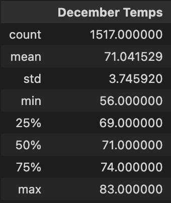
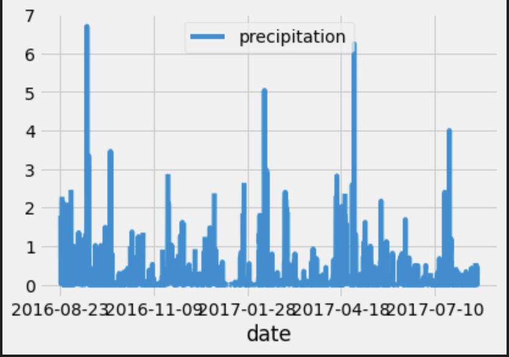
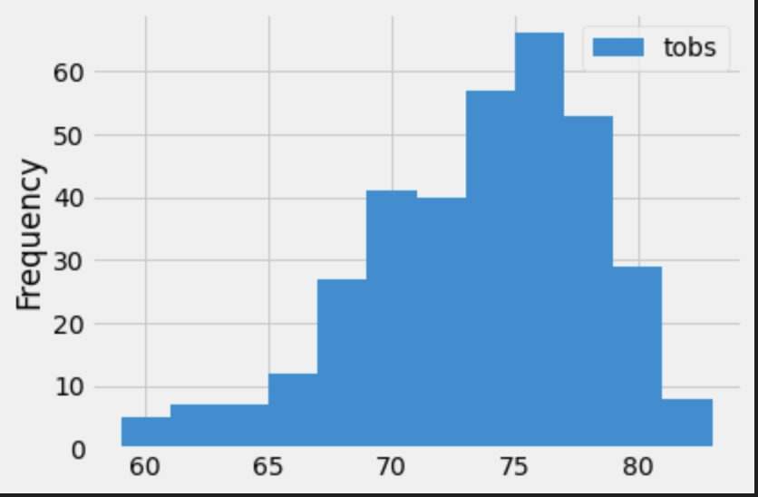

# Surfs_Up Overview:

The purpose of this analysis is to gather more information about temp trends before opening a surf shop.  We are gathering this information to determine if the surf and ice cream shop business is sustainable year-round.

## Results:

# Summary:

Through looking at the precipitation and the temperature proves that investing in Surf n' Shake is a good business venture and that Oahu, Hawaii is the ideal location.